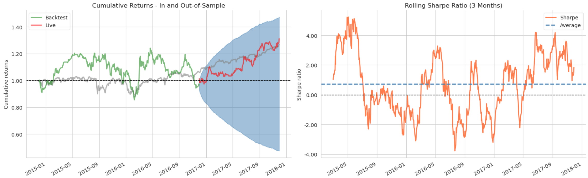

# Stock Price Movement Prediction with PyTorch

This project uses a simple machine learning pipeline in PyTorch to predict 1-day forward returns based on historical data and technical indicators.

This project is for educational purposes only.

The following image shows the output of the backtest using zipline, using a simple NN with two hidden layers, with 16 and 8 neurons, respectively.

## What It Does

- Downloads historical stock data
- Calculates features such as:
  - Technical indicators (RSI, MACD, SMA, ATR, etc.)
- Trains a Neural Network to predict forward returns
- Uses zipline or backtrader to backtest the results with historical data

## Future Improvements

- Enhanced feature engineering (e.g., cross-asset signals)
- Hyperparameter tuning
- Paper trading

## Getting Started

```bash
pip install -r requirements.txt
```
Since zipline is deprecated, other package versions are needed, to run backtests using zipline-reloaded (a maintained version of zipline) do
```bash
pip install -r requirements_zipline.txt
```

The steps to run are

1. ```notebooks/create_datasets.ipynb``` creates the datasets needed
2. ```notebooks/feature_engineering.ipynb``` engineers features for the model
3. ```notebooks/optimizing_NN_pytorch.ipynb``` trains NN
4. ```notebooks/backtest_zipline.ipynb``` backtests using zipline

